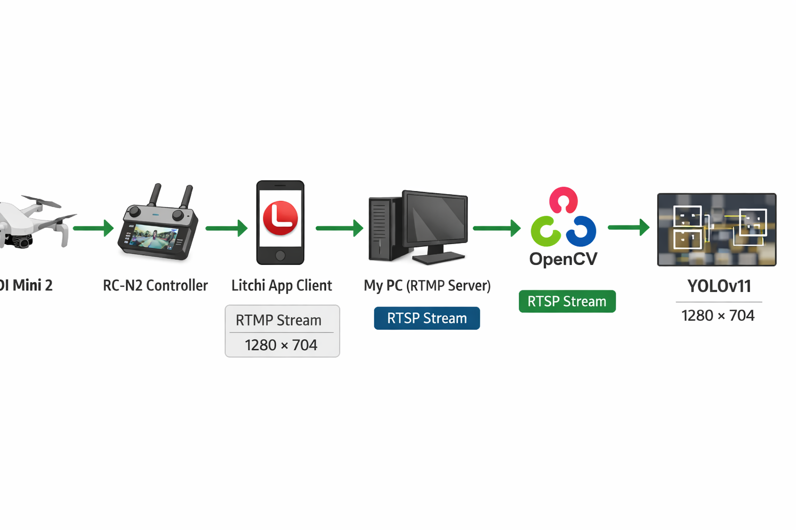

# Person Detection

An early prototype: real-time person / car / bike detection on a live drone video feed.

The drone streams over RTSP (via the Litchi app, 1280×720) to a local relay at
`rtsp://localhost:8554/drone`. `app.py` reads that stream on a background thread so the main loop
always gets the latest frame, resizes each frame to 704×1280, runs YOLOv8 detection (CUDA
required), and shows the annotated result in a window.

## Test footage

Test flights with a **DJI Mini 2**, covering different altitudes (15 m, 30 m, and 50 m) with both
oblique and nadir (straight-down) camera angles:

https://github.com/NickPoint/person_detection/raw/main/Drone%20Feed%202026-03-30%2016-04-34.mp4

### Drone specs (DJI Mini 2)

- Camera: 1/2.3" CMOS, 12 MP, f/2.8, FOV 83°
- Video: up to 4K/30fps, 1080p streamed here via Litchi at 1280×720
- Gimbal: 3-axis mechanical stabilization
- Max flight time: ~31 minutes
- Weight: 249 g

## Contents

- `app.py` — the inference app.
- `yolov8n.pt` — pretrained YOLOv8-nano base.
- `best.pt` — the fine-tuned weights the app loads.

## Results

This was a pipeline shakedown, not a serious model. The fine-tuning run was short and only meant
to confirm the streaming → inference → display loop worked end to end; detection quality on the
live feed was rough. The project then moved on to the trash-detection track:
[trash_detection](https://github.com/NickPoint/trash_detection).
